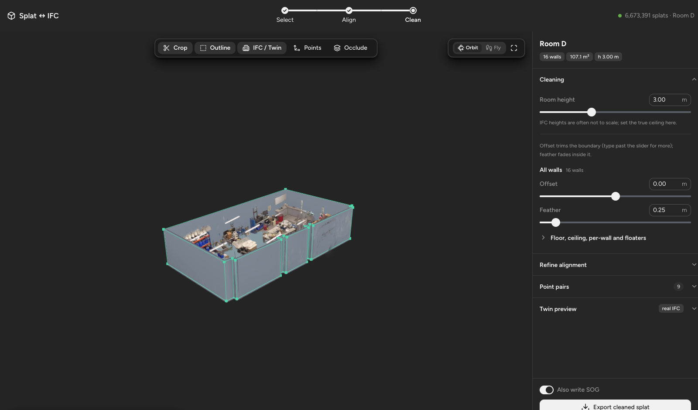
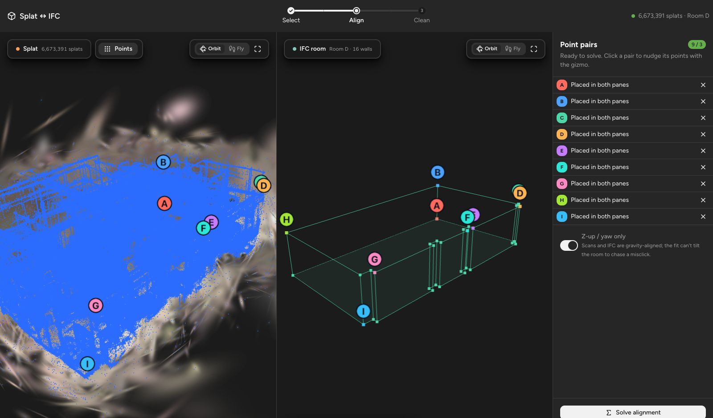
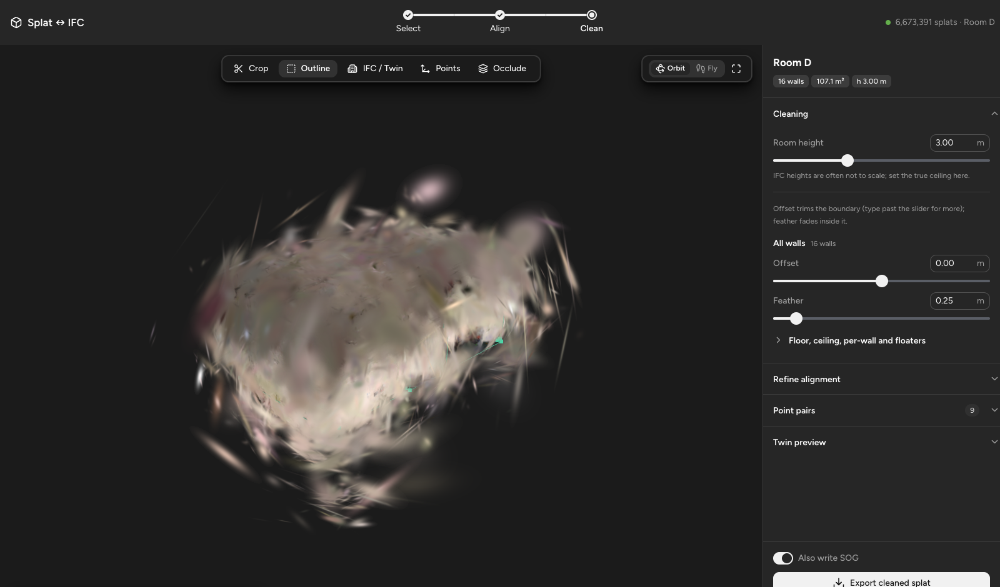
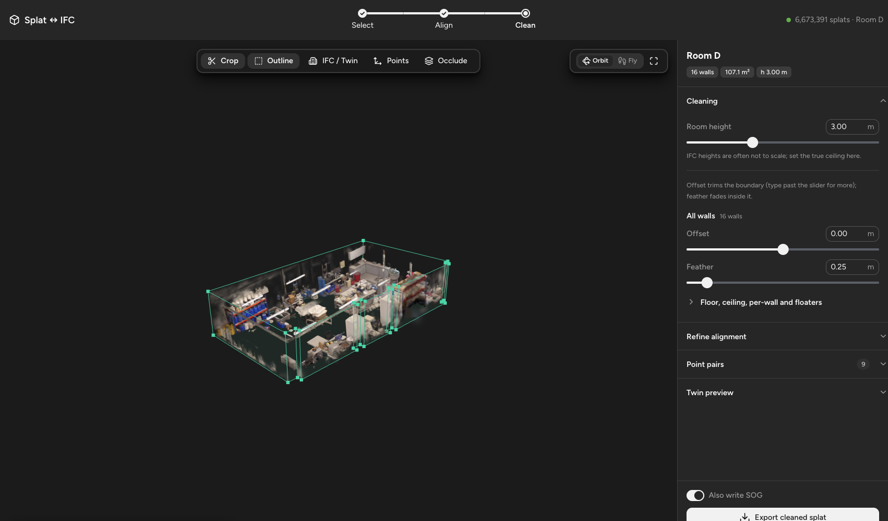
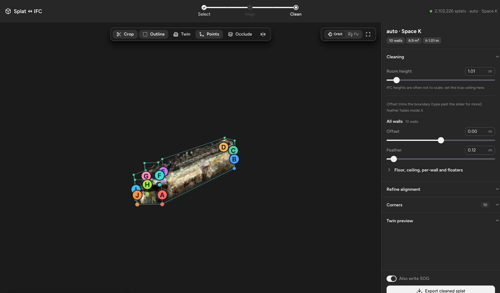
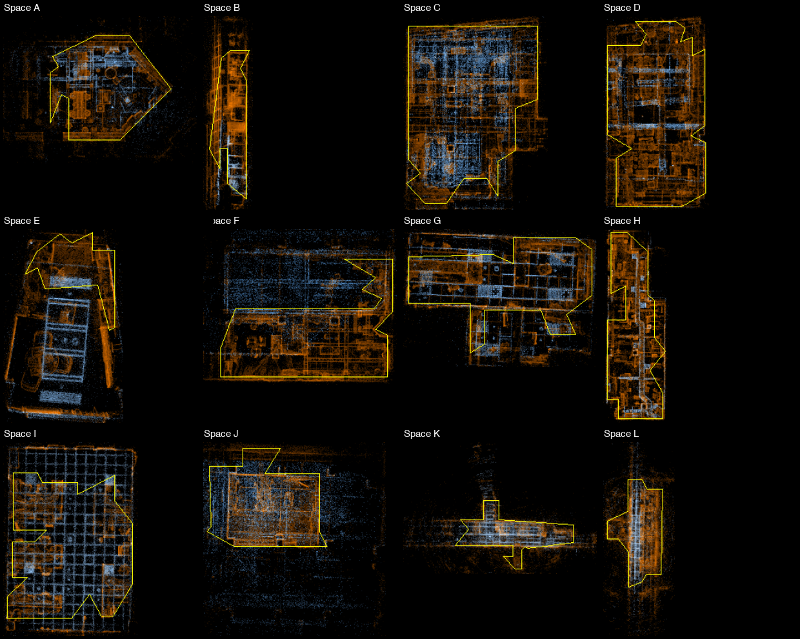

<h1 align="center">SplatRoom</h1>

<p align="center">
  <b>Align Gaussian-splat scans to IFC rooms, crop them to the walls, and export clean, twin-ready assets.</b>
</p>

<p align="center">
  <a href="https://github.com/jdcastano06/splatroom/releases"></a>
  <a href="LICENSE"></a>
  
  
  
  
  
  <a href="https://github.com/jdcastano06/splatroom/stargazers"></a>
</p>

<p align="center">
  <a href="#quick-start">Quick start</a> ·
  <a href="#how-it-works">How it works</a> ·
  <a href="#automatic-room-detection-no-ifc">Auto room</a> ·
  <a href="tool/README.md">Full manual</a> ·
  <a href="#contributing">Contributing</a>
</p>



A raw Gaussian-splat scan of a room is a cloud: floaters, the corridor seen through the door, the
mirrored room under a glossy floor, and no relation to the building model. **SplatRoom** turns
it into an asset a digital twin can load: aligned to the room's IFC, cropped to its walls with a
soft feather, and exported as **PLY** + **SOG** + an **IFC of the room** in the same frame.

Built for scan-to-twin pipelines where every scanned space needs the same treatment, and where
most spaces have no IFC at all.

## Highlights

- **Three ways to get the room.** Align to an **IFC room** by clicking matching points, let
  **⚡ Auto room** detect walls, floor and ceiling from the splat itself, or **✏️ draw a box**.
- **Real-time crop on millions of splats.** The room footprint is baked once into a signed-distance
  field; every slider is a shader uniform. Non-convex rooms with 57 walls cost the same as a box.
- **What you see is what you export.** The preview GLSL and the export NumPy share one formula,
  pinned by a parity test.
- **Per-wall control.** Offset and feather per wall, floor and ceiling; room-height override; a
  floater filter; a nudge-able refine on top of the solve.
- **Twin preview.** See how the IFC will render over the cleaned splat, with the wall thickness you
  choose written into the exported room IFC.
- **Round-trippable.** Every export carries a sidecar; reopen it later, tweak, re-export in place.
- **Hands-off batch mode.** Clean every new scan on a share with one command.

## The workflow

| Stage | What happens |
|---|---|
| **1 · Select** | Pick a scan and where its room comes from: IFC room, Auto room or a drawn box. |
| **2 · Align** | Split view, scan left / IFC right. Click a feature in one pane, then its match in the other, to make a lettered pair. Three pairs and **Solve** fits a similarity transform (Umeyama, yaw-only by default). Drag any pair's point to fix it. |
| **3 · Clean** | Merged view in room space. Crop, feather, room height, refine, floaters, twin preview. |
| **Export** | `cleaned.ply` (full precision), `cleaned.sog` (compressed, web), `cleaned.ifc` (the room box actually used, floor at z = 0) and `cleaned.alignment.json`. |

### Align by clicking pairs

The point overlay makes walls and corners far easier to hit than the soft gaussian blur. Markers
are lettered and coloured identically in both panes.



### Crop and feather to the room

| Before | After |
|---|---|
|  |  |

### Automatic room detection (no IFC)

**⚡ Auto room** finds the Manhattan frame from the splats' normals, the floor and ceiling from
horizontal-disc slabs, and the footprint from where the scan actually saw floor or ceiling (so
haze and what was visible through doors stay out). It drops you into Clean with the box, floater
filter and twin look pre-set.



Plan views of detected footprints across a batch of scans:



```bash
# from tool/server: clean every scan that has no export yet, hands-off
python3 auto_clean.py --new
```

## Quick start

Two processes: a FastAPI backend and a Next.js frontend.

```bash
git clone https://github.com/jdcastano06/splatroom.git
cd splatroom

# backend (Python 3.11+)
cd tool/server
python3 -m pip install -r requirements.txt
SPLAT_ROOT=/path/to/your/scans python3 -m uvicorn app:app --port 8777

# frontend (Node 20+), in a second terminal
cd tool/web
npm install
npm run dev        # open http://localhost:5180
```

Exports call `npx @playcanvas/splat-transform` for the PLY ↔ SOG conversion, so Node must be on
the backend's `PATH` as well.

### Input layout

The backend scans `SPLAT_ROOT` for folders of the form

```
<Project>/<Scan>/result/3D/model-gs-sog/gs.sog      # preview (required)
<Project>/<Scan>/result/3D/model-gs-ply/gs.ply      # full-precision export source (optional)
```

A scan with only a SOG still exports: the server decodes it to a PLY once and caches it.

### Bring your own IFC rooms

Building models are not part of this repository. Put each room's IFC under
`IFC/<room_id>/<anything>.ifc` (IFC4 or IFC2x3; one room per file, or a Revit export with an
`IfcSpace`) and it shows up in the Select stage. No IFC? Auto room and Draw a box need none.

### Environment

| Variable | Default | Purpose |
|---|---|---|
| `SPLAT_ROOT` | `/Volumes/SMART_vault/06_Research_projects/Splats` | Where scans are read from |
| `IFC_ROOT` | `IFC/` | Where room IFCs are read from |
| `OUT_ROOT` | `$SPLAT_ROOT/_Cleaned` | Where exports are written (falls back to `out/` if unreachable) |
| `CACHE_ROOT` | `.cache/` | Baked SDFs and decoded SOGs |
| `VAULT_*` | see `.env.example` | Optional: auto-mount an SMB share holding the scans |

## How it works

- **Preview from SOG, export from PLY.** Same splats, same order, so the small SOG drives the
  viewer while the PLY gives a full-precision export. View-dependent colour (`f_rest_*`) is
  rotated with the splat band by band.
- **Baked SDF crop.** Each room footprint is baked once into a `(signed distance, nearest wall)`
  grid. Every slider is a shader uniform, so there is no re-bake on interaction and non-convex
  rooms are free.
- **One crop formula, two languages.** `tool/server/crop.py` (export) and
  `tool/web/src/crop-shared.js` (preview GLSL) are pinned equal by `tool/tests/test_parity.py`.
- **Alignment** is an Umeyama similarity solved server-side; the manual refine composes a second
  similarity about the room centre.
- **Room IFC on export.** `cleaned.ifc` describes the box actually used (custom, auto, overridden
  height, chosen wall thickness) in the cleaned splat's frame, so a downstream viewer overlays it
  one-to-one.

The stage-by-stage manual, the auto-room algorithm and the test matrix are in
[`tool/README.md`](tool/README.md).

## Repository layout

```
tool/server/   FastAPI backend: alignment, SDF bake, crop/export, auto-room, IFC writer
tool/web/      Next.js + React frontend; Three.js + Spark for splat rendering; Astryx UI
tool/tests/    pytest unit + parity tests, auto-room benchmark/tuning scripts
tool/web/e2e/  Playwright drivers that exercise the real app in Chrome
docs/          Screenshots
```

## Tests

```bash
cd tool && python3 -m pytest tests/           # unit + parity tests (fast, no scans needed)
cd tool/web && node e2e/screenshots.mjs       # drives both flows in a real browser (needs scans)
```

The parity test needs a non-convex room IFC; point it at one with `PARITY_IFC=/path/room.ifc`
or it skips. The older `e2e/drive*.mjs` drivers predate the Next.js UI and still address the
previous DOM; they are kept for reference until they are ported.

## Stack

**Python:** FastAPI · NumPy · SciPy · Shapely · OpenCV · IfcOpenShell
**Web:** Next.js · React · Three.js · [Spark](https://sparkjs.dev) (Gaussian-splat renderer) · Astryx
**Formats:** PLY · SOG (via PlayCanvas `splat-transform`) · IFC4 / IFC2x3

## Contributing

Issues and pull requests are welcome. Good first contributions: porting the legacy e2e drivers
to the Next.js DOM, more scan folder layouts, and alternative room detectors. Please keep
`test_parity.py` green: the export must always compute exactly what the preview shows.

Developed at NYU Abu Dhabi's S.M.A.R.T. group for its lab-scanning pipeline and released as-is.

## License

[MIT](LICENSE)

---

<sub>gaussian-splatting · 3dgs · ifc · bim · digital-twin · scan-to-bim · point-cloud · 3d-scanning · threejs · webgl · nextjs · fastapi · ifcopenshell · ply · sog</sub>
